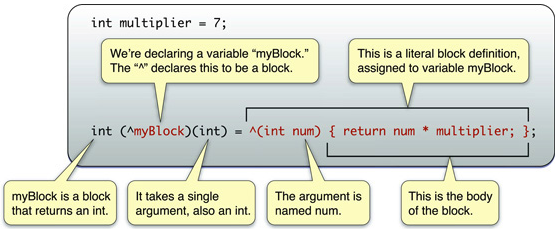

# XCode "區塊運算"分享

Reference from: [Blocks Programming Topics](https://developer.apple.com/library/ios/documentation/Cocoa/Conceptual/Blocks/Articles/bxGettingStarted.html#//apple_ref/doc/uid/TP40007502-CH7-SW1)

在XCode的開發中，會看到 ^符號,它除了可以作為[XOR運算](http://zh.wikipedia.org/wiki/C%E5%92%8CC%2B%2B%E9%81%8B%E7%AE%97%E5%AD%90)外，在XCode還有一個很常用的操作，`^`可作為區塊運算的識別字。有關XCode 的區塊運算是一個非常方便的工具，它可以當作 callback function，也可以將一組function直接嵌入你要呼叫的function𥚃，例如：

````
//在沒有ARC下，可在ViewController 移除後，將自已給釋放
[myViewController dismissViewControllerAnimated:YES 
	completion:^() {
		[myViewController release];
		myViewController = nil;
	}
];
````
在[官網文件](https://developer.apple.com/library/ios/documentation/Cocoa/Conceptual/Blocks/Articles/bxGettingStarted.html#//apple_ref/doc/uid/TP40007502-CH7-SW1)中，開宗明義指出`You use the ^ operator to declare a block variable and to indicate the beginning of a block literal. The body of the block itself is contained within {}。` '^'符號作為區塊(Block)的開頭文字，在使用方法上，請見下圖不解釋了。



除了[官網文件](https://developer.apple.com/library/ios/documentation/Cocoa/Conceptual/Blocks/Articles/bxGettingStarted.html#//apple_ref/doc/uid/TP40007502-CH7-SW1)中所提到的範例，另外我也列出一些我在使用上所使用例子：

* 當 callback function 使用

````
//MyViewController.h
typedef void (^TouchedInside)();

@interface MyViewController : UIView
{
    __strong TouchedInside  _insideBlock;
}
-(void)setTouchedInsideBlock:(TouchedInside)insideBlock;
@end
//MyViewController.m
@implementation FPTouchView
-(void)setTouchedInsideBlock:(TouchedInside)insideBlock
{
    _insideBlock = [insideBlock copy];
}

@end

````

* 把區塊(block)直接嵌入要呼叫函數裡

````
//Declare in UIViewController.h
- (void)dismissViewControllerAnimated: (BOOL)flag completion: (void (^)(void))completion;
//sample
[myViewController dismissViewControllerAnimated:YES 
	completion:^() {
		[myViewController release];
		myViewController = nil;
	}
];
````


