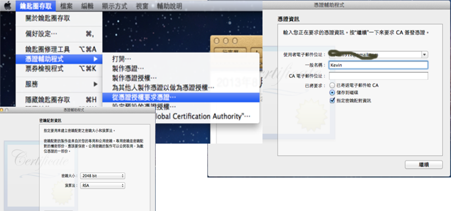
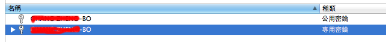

# iOS Development Program (IDP) 瞭解如何設定開發者環境

在註冊成為 Apple 開發者之後，接著便要著手設定環境開始開發 iOS App了；但很多初學者在還沒開始，便已經被如何設定開發環境，搞得昏頭轉向了。
以下便是我作的簡單的整理：

### 1.取得開發者認證 CA

一位合法的 iOS 開發者，要開發出可散佈的 App，首先要要先從 apple 取得合法的CA (所謂CA，即是Certificate Authority；電子憑證)。而 iOS 開發者認證CA有二種；“iOS Development” ﹠“iOS Distribution” ，就字面意思就是研發用和上架用（其實還有其它四種，這裡先不介紹）。**iOS的認證採雙向認證**；所以，要開發者自已先產生“憑證要求檔”，再用這個“認證授權檔”上傳至 Apple，來取得你專屬的認證(xxx.cer)。

#### 1.1 建立“憑證要求檔”來向Apple 要求憑證：
 先開啟程式“鑰匙圈存取”；在從程式選單選取“鑰匙圈存取“->“憑證輔助程式”->“從憑證授權要求憑證來開啟“憑證輔助程式”視窗。
 
1.1.1 使用者電子郵件位址：請填入和開發者帳一致的Email Address. 
1.1.2 一般名稱：你的英文名字 或 公司名稱. 
1.1.3 已將要求：請選擇“儲存到磁碟”，並勾選取”指定密鑰配對資訊“

按選“繼續”，跳至“密鑰配對資訊”，其預設值為“2048 bit”﹠“RSA”，不用動；再來就一直按“續繼”，直到憑證要求檔建立為止。

**當建立憑證要求檔後，在“鑰匙圈存取”的“鑰匙”類別，會產生二個鑰匙。**

#### 1.2 取得開發者憑證
1.2.1 上傳“憑證要求檔”
開啟網頁“http://developer.apple.com”，點取“iOS Dev Center”（此時可能會要求你登入，請登入），在右邊的快捷項目中，點取“Certificates, Identifiers & Profiles”；之後，點取"Certificates"，來設定開發者憑證。

1.2.2 產生憑證設定檔(Profile)
  在“Certificates, Identifiesr & Profiles”頁面下，點取“Certificates”下的“All“。再點取右邉的加號方塊來產生憑證設定檔；當你按了”加號方塊“後，進入Profile 設定頁面。
  這時，有個很重要的事，若從來沒有下載和安裝過WWDR憑證（WWDR？ 目前，所做的事都是為了取得私鑰，而WWDR就是公鑰啦！開發時需要同時要有公私鑰，請在“Profile設定頁面”的最下方，點連結 “Worldwide Developer Releations Certificate Authority”去下載。下載後，雙擊該檔，就會安裝至鑰匙圈了。

當安裝完Certificate後，**在“鑰匙圈存取”的“憑證”類別，可以看到你所安裝的憑證。展開它，可看到它指向產生它的key。**

 
**總結上述**的步驟；為了要取得開發所需要的電子憑證，要先自行產"憑證要求檔"，在產生憑證要求檔後，便會在鑰匙圈內產生**專用密鑰**；接著登入“Apple 開發者網站”，先取得WWDR公用憑證，依指示上傳“憑證要求檔”，以產生開發者憑證，以上； 但要注意要在發開過程沒有錯誤，這三個東西，一個都不能少；也就是WWDR，開發者憑證和產生憑證用的專用密鑰，全都要都在**鑰匙圈**內。 
有關CA憑證就是這樣啦～ 但可以開發了嗎？答是 ...還早，開發還需Provisioning profiles

### 2.在“Certificates, Identifiers & Profiles” 頁面中
 

#### 2.1 Certificates：
用來管理CA憑證的地方，先前就是產生CA的方法。

#### 2.2 Identifiers：
建立和管理另 AppID 的地方, 每一個App都有一組全世界唯一的ID，就在這裡建立管理；除了AppID，另外的是給Passbook和推播用的 ID。

#### 2.3 Device：
建立和管理測試用的iPhone和iPad。一個開發者帳號只能列100個裝備(device)。

#### 2.4 Provisioning profile: 
管理Provisioning profile：（它的性質很像是一組設定檔）是Certificate/ID/Devices的集合（注意，我在device 使用複數）。舉例：假設我要開發一個新的App，叫“HappyApp”， 而devices已經建立了我和客戶所有測試用的機器。於是，我先到App ID去建立一組HappyApp專屬的ID，再到Provisioning 建立一組新的開發用profile，在profile設定頁面中，選擇一個**開發用CA憑證**和”HappyApp”的AppID，再將要測試用的機器勾選起來，最後按建立，便可產生一個給”HappyApp”**開發用的provisioning profile。** 而要給”HappyApp”上架用的profile要另外建立（只需選上架用CA和這個”HappyApp”的ID即可)。最後，將這二個Profiles下載下來，**放入XCode的Organizer(在啟起XCode程式，按shift+command+2，即可開啟Organizer)**。新建HappyApp這個XCode專案時，要需要AppID一致，並在設定中分別選擇這二個Profiles給開發和上架用，即可